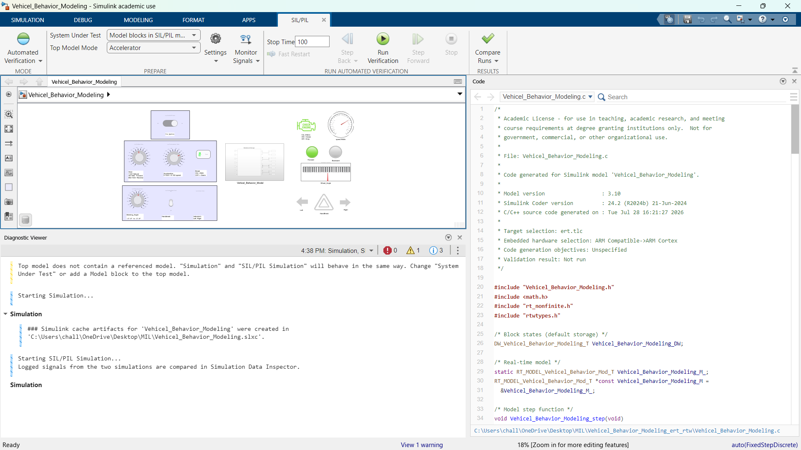
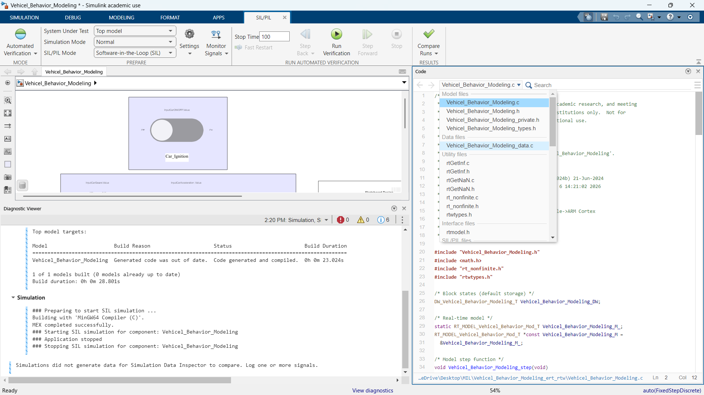
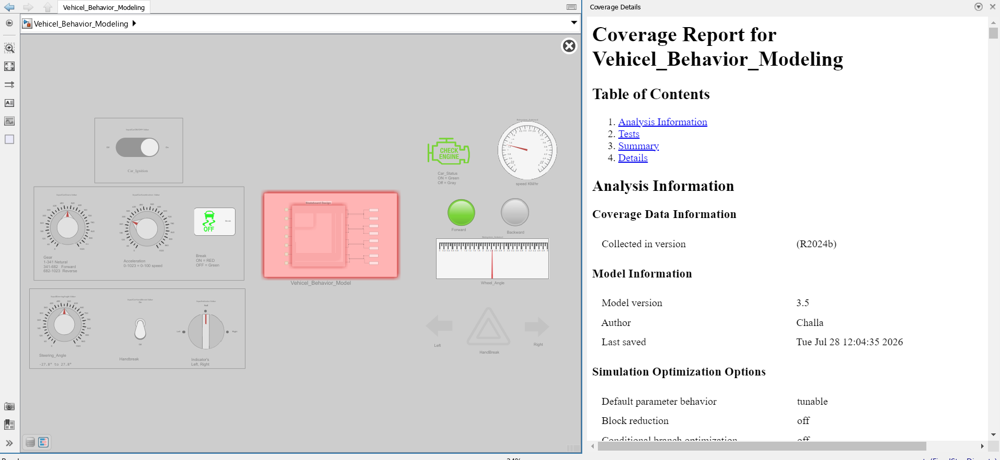
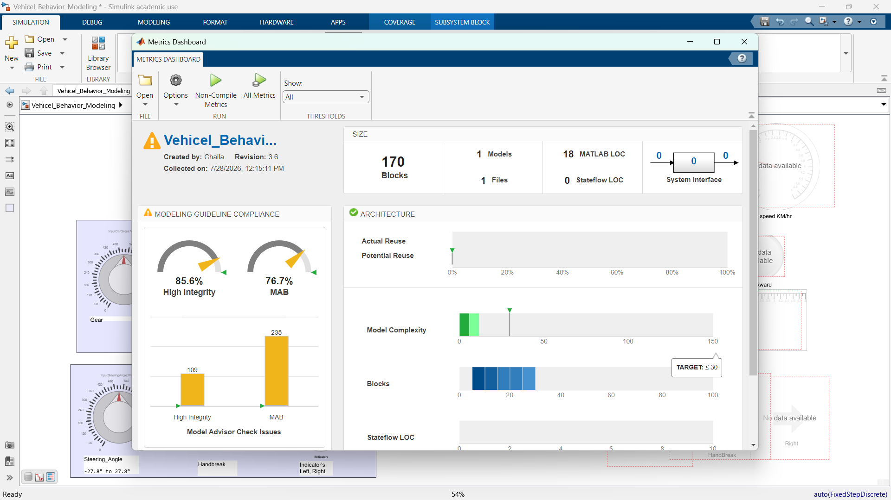

# Vehicle Behavior Modeling: MIL, SIL, PIL & HIL Development Pipeline

[](https://uk.mathworks.com/products/simulink.html)
[](https://uk.mathworks.com/help/ecoder/)
[](https://www.dspace.com/)
[](https://www.mdpi.com/2079-9292/11/15/2462)

**A Masterclass Repository for Automotive Model-Based Development (MBD)**  
This repository provides an end-to-end, production-grade implementation of a vehicle behavior controller for a Skateboard Electric Vehicle (EV) platform using **MATLAB R2023b**. It follows the complete **Automotive V-Model Software Engineering Lifecycle**, transitioning seamlessly from control concept to real-time Hardware-in-the-Loop (HIL) deployment using **dSPACE ConfigurationDesk** and **dSPACE ControlDesk**.

---

## 📋 Table of Contents

- [📌 Executive Overview](#-executive-overview)
- [🔄 The Automotive V-Model & MBD Integration](#-the-automotive-v-model--mbd-integration)
- [🧠 Chain-of-Thought Development Flow](#-chain-of-thought-development-flow)
  - [Step 1: Model-in-the-Loop (MIL)](#step-1-model-in-the-loop-mil)
  - [Step 2: Software-in-the-Loop (SIL)](#step-2-software-in-the-loop-sil)
  - [Step 3: Processor-in-the-Loop (PIL) Roadmap](#step-3-processor-in-the-loop-pil-roadmap)
  - [Step 4: Hardware-in-the-Loop (HIL) on dSPACE (ConfigurationDesk & ControlDesk)](#step-4-hardware-in-the-loop-hil-on-dspace-configurationdesk--controldesk)
- [🛠️ Control System Functional Specifications](#️-control-system-functional-specifications)
- [🎓 Educational Learning Guide: How to Use This Repo](#-educational-learning-guide-how-to-use-this-repo)
- [📊 Requirements Traceability & Model Coverage](#-requirements-traceability--model-coverage)
- [📂 Repository Directory Structure](#-repository-directory-structure)
- [🔗 References & Academic Citations](#-references--academic-citations)

---

## 📌 Executive Overview

In modern automotive software engineering (e.g., ISO 26262 functional safety standards), embedded software for Electronic Control Units (ECUs) is built using **Model-Based Design (MBD)** in **MATLAB R2023b**. Instead of writing low-level C/C++ code manually, control algorithms are modeled graphically in Simulink, rigorously tested at the model level, automatically converted into production C code, and deployed onto real-time hardware test benches configured via **dSPACE ConfigurationDesk** and monitored via **dSPACE ControlDesk**.

### Target Audience & Use Cases:
* **Students & Researchers**: A practical hands-on benchmark to understand how software moves from mathematical Simulink equations in MATLAB R2023b to dSPACE hardware racks.
* **Control Systems & MBD Engineers**: An exemplar codebase demonstrating requirement-to-code traceability, coverage reports, MEX SIL wrapper generation, and dSPACE SCALEXIO ConfigurationDesk/ControlDesk workflows.
* **Embedded Software Engineers**: Clean auto-generated C code ([`Vehicel_Behavior_Modeling.c`](S_I_L/Vehicel_Behavior_Modeling_ert_rtw/Vehicel_Behavior_Modeling.c)) targeting ARM Cortex architectures.

---

## 🔄 The Automotive V-Model & MBD Integration

The development process follows the classical **V-Model**, connecting high-level requirement specifications on the left leg to empirical verification and hardware test execution on the right leg.

  
*Figure 1: Model-Based Design (MBD) V-Cycle testing paradigm connecting MIL, SIL, PIL, and HIL stages ([Source: MDPI Electronics](https://www.mdpi.com/2079-9292/11/15/2462)).*

### The 4 Verification Tiers at a Glance:
1. **MIL (Model-in-the-Loop)**: Test control algorithms against continuous plant models inside the Simulink environment in MATLAB R2023b.
2. **SIL (Software-in-the-Loop)**: Compile the auto-generated production C-code into host S-functions and verify bit-exact behavior against the MIL reference model.
3. **PIL (Processor-in-the-Loop)**: Execute generated C-code on a target processor (e.g., ARM Cortex / Raspberry Pi) to validate compiler optimization, word sizes, and execution timing.
4. **HIL (Hardware-in-the-Loop)**: Connect the compiled binary to a real-time simulator (dSPACE SCALEXIO) configured via **dSPACE ConfigurationDesk** and instrumented via **dSPACE ControlDesk** to emulate physical electrical I/O, sensors, and actuators in real time.

---

## 🧠 Chain-of-Thought Development Flow

---

### Step 1: Model-in-the-Loop (MIL)

**Concept:** In the MIL stage, system requirements are modeled graphically using Simulink blocks and state-machines in MATLAB R2023b. The controller algorithm interacts with simulated driver inputs (Ignition, Gear Lever, Accelerator, Brake, Steering, Handbrake, and Indicators).

#### Functional Architecture Highlights:
* **Ignition Interlock (`REQ-SW-010/011`)**: When `CarON/OFF = 0`, an interlock overrides the gear selector and forces the output state to **Neutral (`0`)**.
* **Gearbox Selector (`REQ-SW-020/021`)**: Maps analog gear position (`0-1023`) to discrete Reverse (`-1`), Neutral (`0`), and Forward (`1`) states.
* **Brake Override (`REQ-SW-030`)**: Applying the brake pedal ($\le 200$) instantly zeroes out acceleration demand regardless of throttle position.
* **Engine Speed Engine (`REQ-SW-040/041`)**: Computes engine output speed as $5 \times \max\left(\text{GearGain} \times (\text{Acceleration} - 10 \times \text{HandBrake}), 0\right)$.
* **Turn Indicator Auto-Cancel (`REQ-SW-060/070`)**: Utilizes a 1500-step delay buffer and a custom MATLAB function block to automatically reset indicators when steering returns to center.

#### MIL Output Verification Video
Watch the simulation response of the Simulink reference model (`Vehicel_Behavior_Modeling.slx`) during closed-loop execution:

<video src="M_I_L/MIL_Output/Mil_1_output.mp4" controls width="100%"></video>

*Direct File Link:* [M_I_L/MIL_Output/Mil_1_output.mp4](M_I_L/MIL_Output/Mil_1_output.mp4)

---

### Step 2: Software-in-the-Loop (SIL)

**Concept:** Once MIL behavior is validated, MathWorks Embedded Coder (`ert.tlc`) in MATLAB R2023b automatically translates the Simulink model into optimized production C/C++ code ([`Vehicel_Behavior_Modeling.c`](S_I_L/Vehicel_Behavior_Modeling_ert_rtw/Vehicel_Behavior_Modeling.c)). SIL compiles this generated code into a DLL/MEX S-function on the host PC to verify that code-generation introduced zero numerical drift or logic errors.

#### SIL Layout & Scope Verification Plots

| Simulink SIL Subsystem Architecture | SIL Scope Signal Response #1 | SIL Scope Signal Response #2 |
| :---: | :---: | :---: |
|  |  |  |

---

### Step 3: Processor-in-the-Loop (PIL) Roadmap

**Concept:** PIL executes the compiled C code on a physical embedded processor (such as an ARM Cortex-M/A micro-controller or Raspberry Pi / Jetson AGX Orin) while the plant model runs on the host computer.

#### Hardware Target Mapping:
* **Host Workstation (PC)**: MIL & SIL execution in MATLAB R2023b.
* **Raspberry Pi 4/5 (ARM Cortex)**: Early PIL target running cross-compiled binaries over CAN-HAT / GPIO.
* **Jetson AGX Orin**: Embedded PIL target for compute-heavy perception + control workloads.
* **Arduino Mega 2560**: Hardware ECU stand-in driving physical actuators (servos, LEDs, PWM motors).

---

### Step 4: Hardware-in-the-Loop (HIL) on dSPACE (ConfigurationDesk & ControlDesk)

**Concept:** HIL testing connects the controller to a real-time dSPACE **SCALEXIO / LabBox** simulator. Real electrical signals (analog voltages, digital switching, PWM signals, and CAN messages) pass between the dSPACE I/O cards and the physical ECU stand-in.

#### 🛠️ dSPACE Software Tools Integration:
1. **dSPACE ConfigurationDesk (`Hardware Topology.htfx` & `Application.cfgx`)**:
   - Maps controller Simulink ports to real dSPACE SCALEXIO hardware channels (Analog In/Out, Digital I/O, CAN buses).
   - Manages real-time application building, hardware board assignment, and task execution scheduling on the dSPACE RTOS kernel.
2. **dSPACE ControlDesk (`Project_001.CDP` & `Experiment_001.CDE`)**:
   - Provides a real-time interactive user interface (dashboards, sliders, switches, gauges, and oscilloscopes).
   - Allows control engineers to inject live signals (e.g., simulated throttle, brake, steering angle) and capture real-time hardware response telemetry.

#### HIL Test Execution Videos

##### Video #1: ControlDesk Instrumentation & Real-Time Monitoring
<video src="vehicel_behaviour_HIL_Dspace/Outputs/Output1.mp4" controls width="100%"></video>

*Direct File Link:* [vehicel_behaviour_HIL_Dspace/Outputs/Output1.mp4](vehicel_behaviour_HIL_Dspace/Outputs/Output1.mp4)
---

## 🛠️ Control System Functional Specifications

The master Excel specification ([`03_MBD_dSPACE_Requirements_and_VV_Spec_v2.xlsx`](03_MBD_dSPACE_Requirements_and_VV_Spec_v2.xlsx)) defines traceable software requirements:

| REQ-ID | Subsystem / Path | Requirement Description | Safety Class |
| :--- | :--- | :--- | :---: |
| **REQ-SW-010** | Root / Ignition | Car ON/OFF LED shall be driven directly from Car ON/OFF input with zero filtering. | Class B |
| **REQ-SW-011** | Gear Box | WHEN Car ON/OFF = 0, system shall force Gear output to Neutral (0), overriding lever position. | Class A |
| **REQ-SW-020** | Gear Box | System shall select Reverse (-1), Neutral (0), or Forward (1) from analog input bands. | Class A |
| **REQ-SW-021** | Root / Output | System shall output `ForwardGear` and `BackwardGear` as independent boolean flags. | Class B |
| **REQ-SW-030** | Accel & Brake | WHEN Brake Paddle $\le 200$, system shall zero acceleration output (Brake Override). | Class A |
| **REQ-SW-031** | Accel & Brake | WHEN Brake Paddle $> 200$, system shall scale accelerator input to integer range 0-20. | Class B |
| **REQ-SW-040** | Engine | System shall compute engine speed based on Gear Gain, Acceleration, and Handbrake position. | Class A |
| **REQ-SW-060** | Steering | System shall convert raw analog steering input into centered, quantized intermediate signal. | Class A |
| **REQ-SW-070** | Steering / Indicator | MATLAB Function shall assert `IndicatorLeft` or `IndicatorRight` with auto-center reset logic. | Class B |

---

## 🎓 Educational Learning Guide: How to Use This Repo

If you are learning Model-Based Development, follow this step-by-step guide to run and explore this repository:

### Prerequisites
1. **MATLAB & Simulink R2023b** (or compatible)
2. **Simulink Coder & Embedded Coder Toolbox**
3. **dSPACE ConfigurationDesk & dSPACE ControlDesk** (Optional, for HIL hardware execution)
4. **Python 3.8+** (with `openpyxl` for requirements inspection)

### Step-by-Step Hands-On Workflow:

1. **Explore the MIL Model**:
   - Open MATLAB R2023b and navigate to the project directory.
   - Open [`Vehicel_Behavior_Modeling.slx`](Vehicel_Behavior_Modeling.slx) or [`M_I_L/Vehicel_Behavior_Modeling1.slx`](M_I_L/Vehicel_Behavior_Modeling1.slx).
   - Run the simulation (`Ctrl+T`) and observe signal traces in the Scope blocks.

2. **Inspect the Requirements & Traceability Matrix**:
   - Open [`03_MBD_dSPACE_Requirements_and_VV_Spec_v2.xlsx`](03_MBD_dSPACE_Requirements_and_VV_Spec_v2.xlsx) to inspect the V-Model traceability matrix, test cases, and open architectural decisions.

3. **Analyze Auto-Generated SIL Code**:
   - Navigate to [`S_I_L/Vehicel_Behavior_Modeling_ert_rtw/`](S_I_L/Vehicel_Behavior_Modeling_ert_rtw/).
   - Open [`Vehicel_Behavior_Modeling.c`](S_I_L/Vehicel_Behavior_Modeling_ert_rtw/Vehicel_Behavior_Modeling.c) and [`Vehicel_Behavior_Modeling.h`](S_I_L/Vehicel_Behavior_Modeling_ert_rtw/Vehicel_Behavior_Modeling.h) to study how Embedded Coder converts Simulink Delay, Switch, and Math blocks into standard C code.

4. **Review dSPACE HIL Configurations**:
   - **ConfigurationDesk Setup**: Open [`vehicel_behaviour_HIL_Dspace/Configurationdesk/Vehicel_behaviour_model/Application_001/Application.cfgx`](vehicel_behaviour_HIL_Dspace/Configurationdesk/Vehicel_behaviour_model/Application_001/Application.cfgx) in **dSPACE ConfigurationDesk** to inspect hardware channel topology (`Hardware Topology.htfx`).
   - **ControlDesk Dashboards**: Open [`vehicel_behaviour_HIL_Dspace/Controldesk/Vehicel_Behaviour_CD/Project_001/Experiment_001/Experiment_001.CDE`](vehicel_behaviour_HIL_Dspace/Controldesk/Vehicel_Behaviour_CD/Project_001/Experiment_001/Experiment_001.CDE) in **dSPACE ControlDesk** to view real-time instrumentation dashboards.

---

## 📊 Requirements Traceability & Model Coverage

High model coverage ensures that all execution branches and boundary conditions are tested.

| Model Coverage Analysis Report | Model Metrics Dashboard |
| :---: | :---: |
|  |  |

---

## 📂 Repository Directory Structure

```
Vehicle_Behaviour_model_MIL_SIL_HIL/
├── 📄 03_MBD_dSPACE_Requirements_and_VV_Spec_v2.xlsx  # Master V-Model Requirements & V&V Spec
├── 📄 Vehicel_Behavior_Modeling.slx                  # Root Simulink Vehicle Behavior Model (MATLAB R2023b)
├── 📄 New_Session.mldatx                              # Simulink Test Manager Session
├── 🖼️ Coverage_report.png                             # Model Coverage Analysis Report
├── 🖼️ Metrics_Dashboard.png                           # Model Metrics & Complexity Dashboard
├── 📄 README.md                                       # Master Repository Documentation
│
├── 📂 M_I_L/                                          # Model-in-the-Loop (MIL) Stage
│   ├── 📄 Vehicel_Behavior_Modeling1.slx              # MIL Simulink Reference Model
│   ├── 📄 Vehicel_Behavior_Modeling_sbs.mexw64        # MEX S-Function Binary
│   ├── 📄 Requiremnts_MBD.xlsx                        # Software Requirements Sheet
│   └── 📂 MIL_Output/                                 # Video Output (`Mil_1_output.mp4`)
│
├── 📂 S_I_L/                                          # Software-in-the-Loop (SIL) Stage
│   ├── 📄 Vehicel_Behavior_Modeling.slx              # SIL Configuration Model
│   ├── 🖼️ SIL_model.png, SIL_1.png, Sil_2.png         # SIL Architecture & Scope Plots
│   └── 📂 Vehicel_Behavior_Modeling_ert_rtw/         # Production C/C++ Code (Embedded Coder)
│       ├── 📄 Vehicel_Behavior_Modeling.c             # C Controller Logic Implementation
│       └── 📄 Vehicel_Behavior_Modeling.h             # C Structures & Parameter Headers
│
└── 📂 vehicel_behaviour_HIL_Dspace/                  # Hardware-in-the-Loop (HIL) Stage
    ├── 📂 Configurationdesk/                          # dSPACE ConfigurationDesk Hardware Topology & Task Config (`.htfx`, `.cfgx`)
    ├── 📂 Controldesk/                                # dSPACE ControlDesk Experiments & Dashboards (`.CDP`, `.CDE`)
    ├── 📂 Matlab/                                     # Target-adapted Simulink Models
    └── 📂 Outputs/                                    # Live HIL Test Video Recordings (`Output1.mp4`, etc.)
```

---

## 🔗 References & Academic Citations

1. **MDPI Electronics Paper**: *Model-Based Design and V-Cycle Testing for Automotive Systems*. Available at: [MDPI Article 11(15), 2462](https://www.mdpi.com/2079-9292/11/15/2462).
2. **MathWorks Guidance**: *What are MIL, SIL, PIL, and HIL and how do they integrate with Model-Based Design?* Available at: [MathWorks Central](https://uk.mathworks.com/matlabcentral/answers/440277-what-are-mil-sil-pil-and-hil-and-how-do-they-integrate-with-the-model-based-design-approach).
3. **MathWorks Embedded Coder Documentation**: *Software-in-the-Loop (SIL) Simulation Overview*. Available at: [MathWorks Documentation](https://uk.mathworks.com/help/ecoder/software-in-the-loop-sil-simulation.html).
4. **MathWorks Model-Based Testing Discovery**: *Verification and Validation in Model-Based Design*. Available at: [MathWorks Discovery](https://uk.mathworks.com/discovery/model-based-testing.html).

---

## 📄 License

This repository is maintained for educational, research, and technical demonstration purposes under standard academic licensing.
